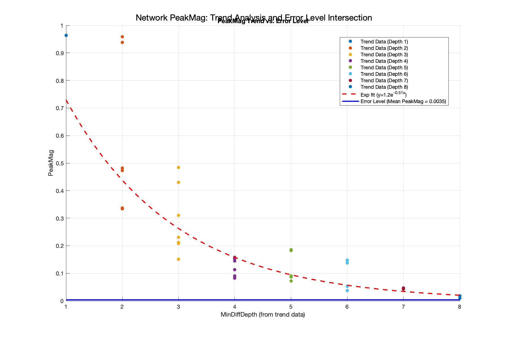

# Findings on May 22 Data

**May 27, 2025**

After building up various networks at least 7 branches deep, I performed analysis on all the network and network pair differences.

In order to test the differences between two similar networks, there were two steps performed.

1. Parse the network strings automatically to output networks with 'n' wire differences (usually n=1)
2. Subtract the two measurement plots, and take the peak magnitude of the difference graph.

Plotting the magnitude of the difference graph against the 'depth' (how many branches down ± 1), gives the following result.

This plot shows the exponential backoff of the amount of difference in signal vs how deep the branches are added.

Given it follows `e^-0.51x`, roughly 60% of the signal is preserved at each step. It seems plausible that theory would predict 2/3 of signal to be preserved, but completely uncomfirmed. More data will be taken.

The lower blue line represents a mean difference when testing measurements of the same network against each other. It is the lower limit for the amount of acceptable variation. The intersection of these two lines is computed by `scripts/plot_trend_vs_error_intersection.m` as 11.45. Further data will be taken to reach this depth of network and verify this extrapolation. 

In this plot, Z00 is inputted as an initial branch, which skews the network accordingly to the right by one wire depth. This means the maximum branches is likely closer to ~10.45.
