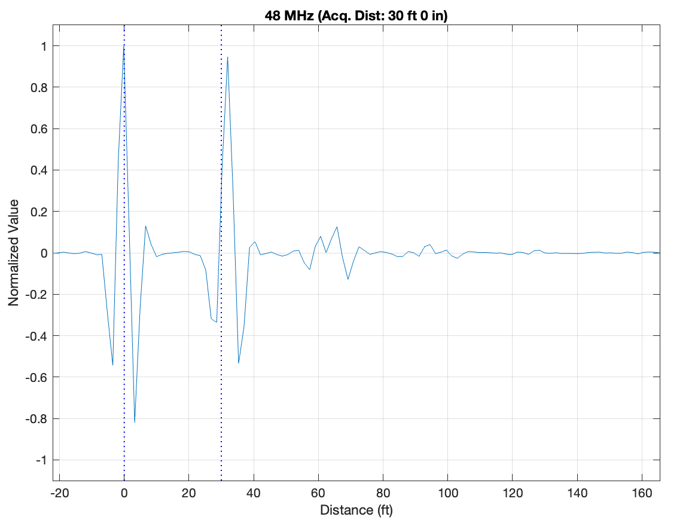

# Cable Measurments

In this folder lives the recorded data from individual cables. The file `cable_logs.csv` contains an overview of all cables that were tagged and measured. Their corresponding data lives inside of `2025-05-20/LiveWire/Static` with `.lws`, `.csv`, and `.png` files for each wire. Additionally, the Z00 file contains the data information for when no wire was connected or present.

Each letter corresponds to an group of wires. The A series are BNCs with orange tape on them; B are BNC but on the shorter end; C are white BNC; D are longer BNC; and E is BNC but with one end cut.

Here's an example of the plot of the wire D00 generated by the scripts in `../../livewire_scripts/`

